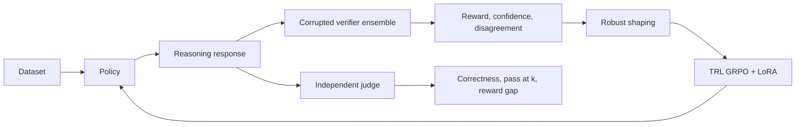

# Robust Reasoning RL Under Imperfect Rewards

A Python research framework for studying whether reasoning policies optimize correctness or
exploit noisy, incomplete, biased, and inconsistent verifier rewards. It implements shared TRL
GRPO training paths, uncertainty-aware reward shaping, independent evaluation, and controlled
corruption sweeps with complete per-generation records.

**Evidence status:** runnable framework with CPU software validation. No benchmark numbers,
trained pretrained-policy comparisons, superiority claims, or fabricated checkpoints are included.

## Motivation and questions

Verifiable mathematics makes reward collection cheap, but an imperfect judge can reward wrong
answers. Observed reward alone cannot establish capability. This project asks:

- How do verifier errors change optimization and independent correctness?
- Can confidence and disagreement based reward shaping reduce reward overfitting?
- Do improvements persist at pass@1 and under a transferred verifier, or depend on repeated sampling?

## Method

Baseline GRPO optimizes the ensemble's observed reward. Robust GRPO can use confidence
weighting, a disagreement penalty, conservative aggregation, or a combination:

`r_robust = attenuation(U) * (r * confidence − lambda * U)`

`U = 4 * population variance of member rewards`. TRL controls the reference-policy KL penalty
through `beta`. Both methods share prompts, data, optimizer settings, generation budget, LoRA,
and verifier construction. Standard-deviation reward scaling is disabled for both paths.
Zero shaped reward is attenuation, **not** a promise of zero GRPO gradient weight.



## Install

Python 3.11+; Python 3.11 is the validated training environment. CPU fixtures require no models.

```bash
python -m venv .venv
# Windows PowerShell: .venv\Scripts\Activate.ps1
# Linux/macOS: source .venv/bin/activate
python -m pip install -e '.[dev]'
# Actual model training and inference:
python -m pip install -e '.[dev,training]'
```

Training uses PyTorch, Hugging Face Transformers/Datasets, TRL 0.26.2, PEFT, and Accelerate.
Core analysis uses NumPy, Pandas, Matplotlib, and safe PyYAML loading. Optional dependencies
keep offline tests lightweight. Models load with remote code execution disabled.

## Quick start

```bash
python scripts/check.py
python -m src.cli evaluate --config configs/evaluation.yaml
python -m src.cli experiment --config configs/smoke.yaml
python -m src.cli plot --results results/fixture-sweep
```

These commands produce explicitly labelled **software fixture** outputs, not RL experiment claims.
The fixture policy derives arithmetic from questions without seeing reference answers. The
`robust-rl` console command is equivalent to `python -m src.cli`. Add `--verbose` before the
subcommand for structured progress events.

## Training, evaluation, and experiments

```bash
python -m src.cli validate --config configs/baseline.yaml
python -m src.cli train --config configs/baseline.yaml
python -m src.cli train --config configs/robust.yaml
python -m src.cli train --config configs/robust.yaml --resume checkpoints/robust/checkpoint-50
python -m src.cli experiment --config configs/reward_corruption.yaml
python -m src.cli plot --results results/grpo-corruption
```

The training examples default to the small open `HuggingFaceTB/SmolLM2-135M-Instruct` model
with LoRA. These commands download model weights. GPU compute is recommended for useful
training; `training.use_cpu: true` supports small CPU runs. Set model/dataset revisions before
research experiments. The full sweep compares real base, baseline, and robust policies using
three seeds and corruption levels 0%, 10%, 20%, 40%, and 60%; all levels are configurable.
Separate local train/evaluation splits demonstrate the workflow without claiming statistical power.

For independent evaluation change `configs/evaluation.yaml` to `model.backend: huggingface`,
set the base model name, and optionally `model.adapter: checkpoints/robust/final`. Set the
reward source under `training_verifier` and the uncorrupted transferred judge under
`evaluation_verifier`. The policy generation backend never receives references.

Central YAML controls learning rate, batch size, gradient accumulation, steps, checkpoints,
KL coefficient, LoRA modules, temperature, top-p, maximum tokens, n generations, and evaluated k.
Paths in configs resolve relative to the repository root. See the
[experiment protocol](docs/experiments.md) for dataset adapters, saved-model evaluation, and budgets.

## Verifier corruption and uncertainty

- Seeded random reward flips and asymmetric false positives/negatives.
- Missing rewards, clipped continuous Gaussian noise, metadata-targeted systematic bias.
- Independent confidence degradation and configurable corruption probabilities.
- Mean, majority, confidence-weighted, and minimum ensemble aggregation.
- Population reward variance, normalized disagreement, vote entropy, and confidence dispersion.

Identical `(seed, example, response)` inputs receive identical corruption, independent of ordering.
Missing signals stay explicit in evaluation. The reward callable imputes zero for optimization,
counts missing/suppressed/downweighted samples, and retains this limitation in the methodology.

## Metrics and capability versus sampling

Reports include independent correctness, pass@1, unbiased pass@k, answer consistency/diversity,
observed reward, coverage, disagreement, conditional false-positive/false-negative rates, and
reward/correctness correlation. The hacking gap is mean normalized observed reward minus
independent correctness on the **same available-reward samples**. Undefined metrics are null.

Comparisons use matched generation budgets and configurable deterministic or stochastic decoding.
An increase in pass@k alone does not establish better single-attempt reasoning. Independent
judging helps detect reward overfitting, but our scalar mathematical verifier remains a proxy.
Full definitions are in [metrics](docs/metrics.md).

## Outputs and visualization

JSON/JSONL preserve configurations, timestamps, Git SHA, package versions, per-member verifier
outputs, extracted answers, reasoning text, independent judgments, and complete generated text.
Sweep CSVs power robustness, reward-hacking, reward/correctness, disagreement, and pass@k
plots. Curves show seed means and standard deviations, not significance. Failed sweep runs
remain in the summary. Generated outputs and checkpoints are ignored by Git.

## Project structure

```text
configs/                 Baseline, robust, evaluation, real sweep and smoke YAML
data/                    Disjoint local arithmetic fixtures
src/data/                Schema and configurable dataset adapters
src/models/              Fixture and pretrained/PEFT generation
src/rewards/             Parsing, verifiers, corruption, ensembles, shaping
src/training/            Shared TRL GRPO integration
src/evaluation/          Independent judge and sampling/hacking metrics
src/experiments/         Multi-seed training and fixture sweeps
src/visualization/       Plots from actual recorded outputs
src/utils/               Configuration, seeds, events and provenance
tests/                   Offline unit/integration and local tiny-model training
scripts/check.py         Quality gates
docs/                    Architecture, methodology, experiments and metrics
```

## Reproducibility, limitations, and integrity

Python, NumPy, PyTorch, and CUDA seeds are configured. Deterministic algorithm warnings remain
visible. Pin model/data revisions, save resolved configs, and account for hardware/library
nondeterminism. CI runs CPU checks and a separate no-download tiny-model training integration.

The parsers support scalar numbers, signs, fractions, boxed answers, and selected formatting;
they do not prove reasoning steps or symbolic equivalence. Ensemble agreement is not calibrated
truth. Synthetic corruption can differ from learned-verifier exploitation. Missing-reward zero
imputation and group centering need careful ablation. Single-process execution is supported.
Repeated output directories overwrite artifacts; use unique campaign paths.

There are no fabricated results, simulated trained-model gains, or SOTA claims. Local random-model
training tests validate engineering only. Meaningful research requires pretrained-model runs,
larger held-out datasets, several seeds, measured compute, and external evaluation.
Potential research extensions include calibrated learned judges, genuinely independent transfer
evaluators, loss-level sample masking, adaptive uncertainty, and multi-domain reward attacks.

Read [architecture](docs/architecture.md), [methodology](docs/methodology.md),
[experiments](docs/experiments.md), and [metrics](docs/metrics.md).
The training adapter follows the pinned
[TRL GRPO API](https://huggingface.co/docs/trl/v0.26.0/grpo_trainer).

MIT licensed.
