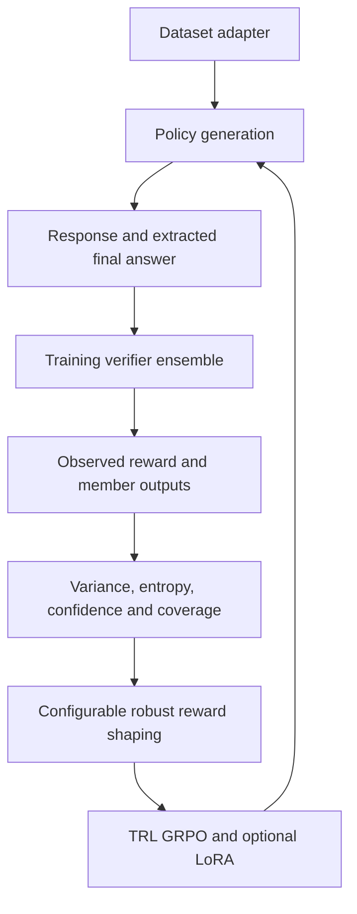
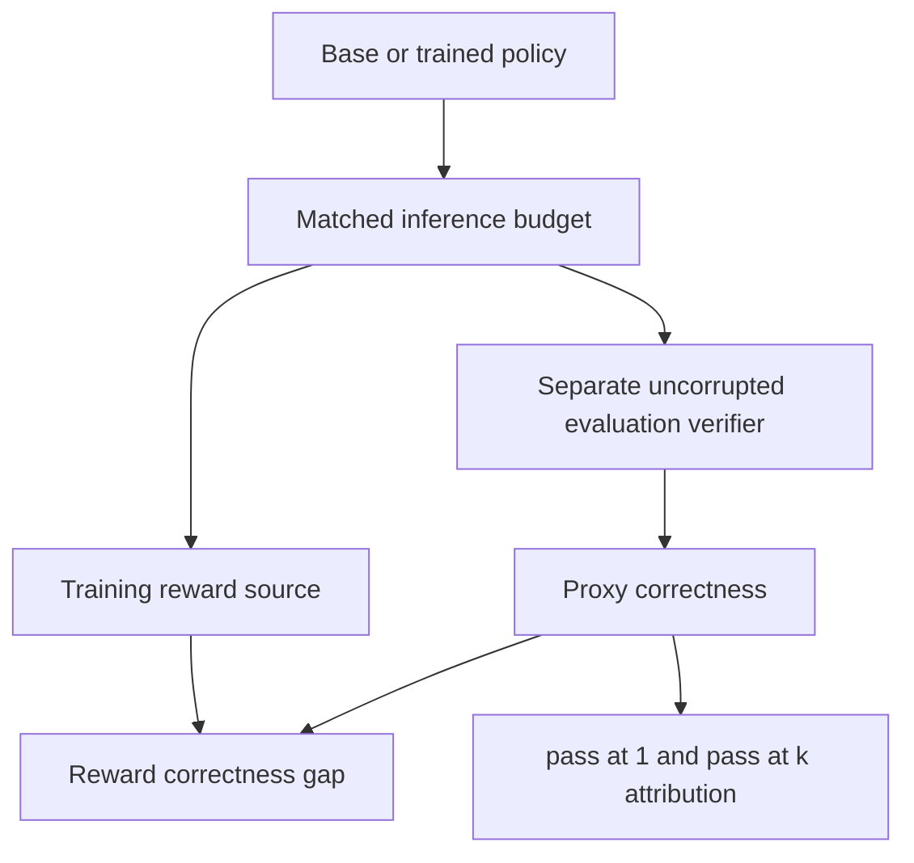

# Architecture

The framework separates generation, reward observation, optimization, and independent judging.
References exist in dataset records and verifier calls. The generation interface receives only
questions, sample counts, and seeds, preventing direct reference leakage.

`src/data` owns local JSONL and Hub adapters and the record schema. Dataset column mappings,
answer separators (for example GSM8K's `####`), split, subset, revision, and limits live in config.
`src/models` owns generation and PEFT adapter loading. `src/rewards` owns parsing, verifiers,
corruption, ensembles, and shaping. Training and evaluation construct reward sources through
the same factory. The evaluation judge is a separate object, configured independently, and
cannot be wrapped in corruption through the evaluation configuration.

`src/training` delegates tokenization, group-relative advantages, KL regularization, optimization,
logging, and checkpoint management to TRL. The callable consumes aligned dataset columns
repeated by TRL for each completion. References never become part of prompt strings.
`src/experiments` launches independent baseline and robust training from the same base model.
`src/evaluation` keeps correctness for every sample even if its training reward is missing.

`src/utils` handles validation, seeds, structured events, and provenance. Result JSON writes
are atomic. Per-generation JSONL and CSV summaries support inspection and analysis. Checkpoints
and generated results are ignored by Git. Large training imports are lazy, so CPU fixture workflows
do not require PyTorch, Transformers, or network access.

The fixture backend derives small arithmetic answers from questions and makes seeded mistakes.
It is exclusively a software-testing backend. It cannot train and is never labelled base GRPO
or robust GRPO. Its outputs carry `software_fixture` provenance and plots carry an explicit label.

Single-process training is the supported execution contract. Launch distributed TRL jobs directly
only after adapting per-rank provenance and output handling; the experiment orchestrator does not
coordinate multi-process rank-specific file writes.
